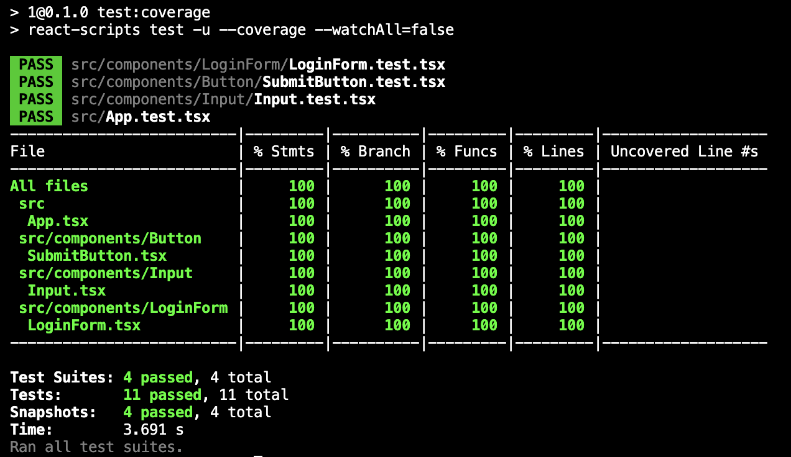

# 1

## TechStack
- React + Jest + Testing Library
- npm package manager

## Run
```
npm tun start
```

## Tests
```
npm run test
```

With Coverage
```
npm run test:coverage
```

Testing App Final Result

